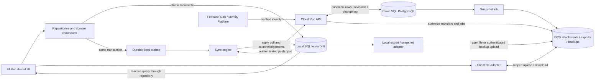
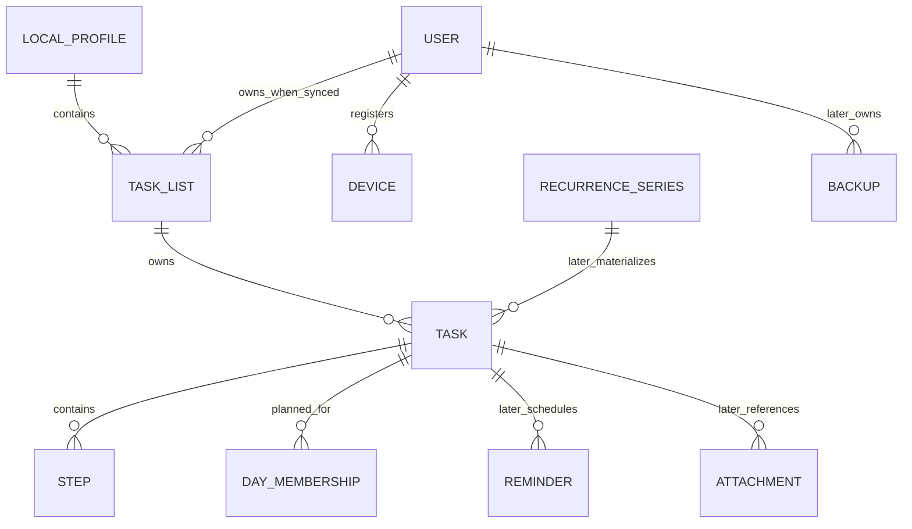

# Docket: product and architecture exploration

Date: 2026-10-03. Mode: **OpenSpec Explore**. Status: recommendations for later proposals; no implementation or deployment.

Read alongside the [Taskmaster reference audit and complete UI inventory](2026-10-03-taskmaster-reference-audit.md). That audit pins the inspected source revision, maps components and screenshots, and distinguishes implemented reference behavior from missing features.

## 1. Product definition and decision status

Docket is a personal task manager with Microsoft To Do's recognizable list-and-detail interaction model, immediate local editing, and optional multi-device cloud synchronization. It should feel deliberate with a mouse and keyboard as well as on a phone. Users organize tasks into lists, choose today's work, mark importance, set deadlines, break work into steps, and keep notes. Additional views and integrations can follow without changing that foundation.

**Settled by the user:** Flutter/Dart; Android, iOS, Windows, macOS, Linux, and Web; local database as client-side source of truth; independent synchronization; separate historical backups; object storage reserved for files/snapshots, with GCS preferred; independently implemented reference-inspired UI. During exploration the user also confirmed **optional accounts with fully usable local-only mode**, and **standard cloud encryption with recoverable accounts**, rather than an initial end-to-end encryption promise.

**Recommended, still subject to proposals:** Drift/SQLite, Riverpod, go_router, a feature-first Flutter application, one Cloud Run API backed by Cloud SQL PostgreSQL, Firebase Authentication with an explicit desktop adapter, revision-based synchronization, and normalized portable backups in GCS. No exact package versions, wire schemas, pane breakpoints, or infrastructure sizes are fixed here.

**Evidence boundary:** Docket initially contained only Git metadata, no commits, source, or OpenSpec configuration. OpenSpec 1.10.0 Explore guidance was read from the installed workflow template, and minimal OpenSpec configuration was initialized to hold this research. Taskmaster was inspected as source and screenshots, not run against its backend. Official platform documentation was checked during this exploration; platform support still needs practical spikes.

The reference's most important contribution is concrete visual agreement: navigation sidebar, prominent list heading and task rows, bottom composer, and optional right detail pane. Its MERN architecture is unsuitable for Docket's offline requirements. See the audit before designing screens.

## 2. Product scope and milestones

| Milestone | Included | Explicitly excluded |
|---|---|---|
| Local MVP | Lists and Tasks inbox; task CRUD; completion/importance; flat steps; plain-text notes; date-only deadlines; My Day; Important and Planned; completed sections; local search; simple suggestions; manual ordering and basic sort; move tasks; theme/density/date settings; responsive navigation; keyboard/context menu/multi-select/drag essentials; durable storage and migrations; basic manual portable export | Accounts required to use app; sync/backend; reminders; recurrence; attachments; groups; sharing; assignment; rich text; advanced analytics |
| Sync | Optional account and local-data adoption; owner isolation; device registration; incremental push/pull; conflict recovery; account recovery/deletion; cloud persistence; observable sync state | Collaboration, presence, simultaneous text editing, always-on background guarantees |
| Cloud/files/recovery | Attachments; transfer queues; cloud backup history; automatic snapshots; verified restore preview/import-as-copy; portable export/import; operational recovery procedures | Silent rollback of an active account; live database blobs in GCS |
| Later | List groups; reminders/notifications; recurrence; step promotion; richer visual customization; tags, priorities, kanban, dependencies, scoring, analytics, calendar integrations, natural-language parsing, AI | No speculative entities or generalized workflow engine in the MVP |

The MVP is the first useful **local** product, not a claim of complete To Do parity. Date-only deadlines are useful without notification promises. Reminders and recurrence warrant separate behavioral proposals rather than barely working settings. All six targets are real: an incremental preview can ship on a subset, but the local-MVP acceptance boundary includes the six-platform matrix. Web persistence and desktop interaction work cannot be deferred until after that milestone.

Basic export is deliberately earlier than sophisticated backup/restore because local-only users need a way to retain their data. Do not call an export a managed backup or imply it contains later attachment bytes unless its manifest says so.

### Behavior to preserve and clarify

- A task has one owning list. Smart lists are views, not extra ownership. **Tasks** is the inbox; it does not mean all tasks.
- Creating in My Day creates in Tasks plus today's membership; creating in Important creates in Tasks plus importance. Creating in Planned requires a chosen deadline. Creating in a custom list uses that list. Search does not silently pick a destination.
- My Day is deliberate daily planning, independent of deadlines. Suggest due/overdue work without automatically changing the user's plan. Old selections remain associated with their date and fall out of today's query; no server cron is needed to clear them.
- Completing a task does not rewrite all its steps. Completing all steps does not silently complete the parent. Completed tasks remain accessible and can be reopened.
- A due date is a calendar date, not midnight UTC. Reminders later carry actual scheduling/timezone semantics.
- Preserve title/circle/star rows, grouped detail controls, quick add, and completed disclosure. Improve focus, metadata, selection, safe deletion, and responsive proportions. Omit nonfunctional share/reminder buttons until the feature exists.

These are recommended Docket semantics. Microsoft's [My Day guidance](https://support.microsoft.com/en-us/todo/my-day-and-suggestions) supports the daily-planning reference, but Docket should document deliberate differences rather than claim exact parity across all Microsoft clients.

## 3. Architecture and ownership



The local database owns what the client renders, including unsynchronized intent. PostgreSQL owns the accepted shared state across devices. These are compatible roles: pending edits are durable locally and reconciled against server revisions later. Neither HTTP responses nor Riverpod caches become a second persistent source of task truth. GCS holds immutable files and snapshots, never mutable task records as the synchronization mechanism.

One local transaction updates domain rows and records pending intent for a sync-enabled profile. The UI reacts to the committed query. A local write failure retains input and visibly reports that it was not saved; network failure does not undo the local transaction. In local-only mode the same domain commands work, but no unbounded lifetime upload queue is necessary: first cloud adoption can enumerate a consistent baseline.

Start with a modular monolith on each side. No event bus, microservice fleet, generic repository framework, or CRDT framework is justified. Flutter's [architecture recommendations](https://docs.flutter.dev/app-architecture/recommendations) and [offline-first patterns](https://docs.flutter.dev/app-architecture/design-patterns/offline-first) support separating UI from data access; Docket's specific transaction/outbox contract is our proposed design.

## 4. Client architecture

### Organization and state management

Recommend **one Flutter package initially**, feature-first with small internal layers. Do not create a package for every feature or duplicate domain models across platform folders.

```text
lib/
  app/                  bootstrap, dependency composition, router, theme
  features/
    shell/              navigation, responsive panes, shortcuts
    tasks/              presentation, commands, domain, repository
    lists/              presentation, commands, domain, repository
    search/             local search presentation and queries
    settings/
    account/            added at sync milestone
    sync/               orchestration and recovery; no widgets in protocol code
    attachments/        added when needed
    backup/             export first; backup/restore later
  data/local/           Drift schema, DAOs, migrations, connection factory
  platform/             capabilities, files, credentials, notifications
  shared/               small UI primitives and truly shared value types
test/                   domain, repositories, migrations, protocol simulations
integration_test/       actual platform and interaction checks
```

Features may have `presentation/`, `application/`, `domain/`, and `data/` folders when enough code exists. The central database owns cross-feature transactions; features should not own separate SQLite files. UI depends on repository contracts and domain commands, not Drift-generated rows or Firebase classes. Introduce use-case classes only for nontrivial operations such as moving a task, adopting local data, or restoring a snapshot. Pure date/rank/merge logic remains Dart-testable. Extract a pure Dart package only when there is an actual second consumer or a useful enforced boundary.

**Riverpod is the recommended state/dependency tool.** Providers expose repository streams and scoped command controllers; ephemeral selection, filters, loading of local DB, and editor drafts have explicit owners. Persistent task collections remain in Drift. Plain `ValueNotifier`/`ChangeNotifier` is viable for a smaller app but needs more manual dependency and lifecycle discipline here. Bloc is viable but adds event/state ceremony without improving the database ownership model. Redux is unnecessary. Avoid using Riverpod's experimental persistence as an alternative task database. Source for available provider/override capabilities and optional generation: [Riverpod documentation](https://riverpod.dev/docs/introduction/getting_started).

Text editing needs special treatment: focused controllers should not be replaced by incoming query snapshots. Persist edits with a short local debounce and flush on navigation/lifecycle events; retain the draft until commit succeeds. Remote changes to a focused field become reviewable changes rather than overwriting the caret or text. Exact debounce and IME behavior belong in the task UI proposal.

### Navigation and responsive composition

Recommend **go_router**, which provides URL-based routing and shell routes; a hand-built Navigator 2 configuration buys little here. Source: [go_router package documentation](https://pub.dev/packages/go_router).

Routes identify logical state, for example `/lists/:listId`, `/smart/my-day`, and a selected task within either context. Search/settings/account have routes where browser history is meaningful. A task URL must not depend on list-title text. Selection should survive browser refresh and window resizing. Routing does not fetch from the network and must not redirect local-only users to sign-in.

```text
Wide:     [ Navigation ][ Task list ][ Selected task detail ]
Medium:   [ Navigation ][ Task list ] + detail overlay/replacement
Compact:  Lists -> Tasks -> Task detail
```

Use layout constraints, text scaling, and minimum usable pane widths rather than device-name tests. Illustrative starting widths are 240–300 logical pixels for navigation, 360+ for task content, and 320+ for detail; these are design-spike inputs, not fixed breakpoints. Below the combined usable width, collapse a pane. Medium-width detail can cover the task area while retaining navigation; compact detail becomes a page. Preserve draft, selection, focus, and scroll throughout. Back closes the top dialog/detail before leaving its context; a deep link without history has a sensible list destination.

A shared Docket design system should own row density, colors, spacing, and pane surfaces. Use Flutter's accessible primitives with suitable platform dialogs/menus where helpful. Neither a wholesale Material default nor a Windows-only Fluent package should dictate every platform's UI. The [reference audit](2026-10-03-taskmaster-reference-audit.md) contains the full desktop contract and surface inventory.

### Platform abstractions

Inject capability-oriented adapters for database opening, durable files/exports, credential storage, external browser login, notifications, lifecycle/scheduling, and file picking. Most UI can ask whether a capability is available; it should not scatter `Platform.isWindows` checks. Clock/timezone and identifier generation should also be injectable for tests. Keep interfaces narrow and add them when used.

## 5. Local persistence, including Web

### Recommendation and alternatives

**Proceed with Drift/SQLite, conditional on an early browser proof.** Its relational fit, generated typed queries, reactive reads, migrations, transactions, and testable SQL address the actual task/list/step workload. Native targets and Web are supported through different connection mechanisms. Source: [Drift platform support](https://drift.simonbinder.eu/platforms/).

| Option | Fit and cost | Recommendation |
|---|---|---|
| Drift + SQLite | One schema/query model; native database and browser WASM connection; code generation and browser deployment assets need care | Preferred |
| sqflite family | Good lower-level SQLite API; manual reactive/query mapping; Windows/Linux need FFI variant, web variant is documented experimental | Viable fallback, no current reason to prefer it |
| Native SQLite + separate IndexedDB domain implementation | Can use browser APIs directly; doubles migrations/query/conformance work | Only if Drift browser spike demonstrates a material blocker |
| Key-value/document store | Convenient simple objects; task relationships, transactional outbox and cross-view queries become application work | No advantage for this domain |

The sqflite platform distinctions come from its [maintainer documentation](https://pub.dev/packages/sqflite). This comparison is about Docket's requirements, not a blanket ranking of databases.

| Target | Proposed persistence | Platform validation needed |
|---|---|---|
| Android | Native SQLite, background executor | Process kill/reopen, scoped app storage, storage-full failure |
| iOS | Native SQLite in application support storage | Suspension, file protection/backup policy, OS termination |
| Windows | Native SQLite | File locking, concurrent window/process policy, installer upgrades |
| macOS | Native SQLite | Sandbox paths, signing/distribution, lifecycle |
| Linux | Native SQLite | Packaged native dependencies, permissions, distribution assumptions |
| Web | SQLite/WASM with a durable browser backend | Actual engine/storage mode, multi-tab coordination, quota, restart/offline reload |

Use foreign keys, explicit transactions, indexes on list/completion/deadline/membership, and schema version 1 from the first release. Store schema snapshots and test upgrades from every supported released schema with representative data; do not use destructive migration fallbacks. Test database behavior against real SQLite as well as in-memory tests. Drift documents [migration tooling and tests](https://drift.simonbinder.eu/migrations/); these become release checks, not merely generated files.

Native database work should run off the UI isolate where appropriate. Files belong in application support storage, not a user's synced documents folder. A single writable profile connection service is preferable to accidental multi-process access; desktop multi-window support can initially mean one active app instance. Standard cloud encryption does not imply the local SQLite file is independently encrypted: use OS protections initially, document this, and keep credentials in platform secure storage.

### Web is a first-class, capability-tested target

Drift's stable WASM API selects storage according to browser capabilities, including OPFS and IndexedDB-backed workers; unsafe multi-tab and in-memory fallbacks exist. Some efficient paths require COOP/COEP headers, which can interfere with authentication popups. Web import does not support native WAL databases. These are documented constraints, not reasons to abandon Flutter. Source: [Drift Web](https://drift.simonbinder.eu/platforms/web/).

Proposed web contract:

1. Inspect the selected storage implementation. Do not silently label an in-memory session “saved.” If safe durable storage is unavailable, show an explicit unsupported-storage screen with recovery/export of any existing data, rather than creating a normal-looking disposable workspace.
2. Support current Chrome/Edge, Firefox, and Safari through tested capabilities. Include Android Chrome and iOS Safari. Do not copy old version numbers from documentation into the support policy.
3. Prefer one schema and repository implementation with a native/web connection factory. If safe IndexedDB-backed SQLite passes tests, accept it despite different performance. A second domain database is a last resort.
4. Serialize sync ownership across tabs, while allowing safe database query updates. Use a tested cross-tab lock/lease; opening a second tab must not create a second device identity or duplicate outbox worker. Coordinate schema upgrades and instruct stale tabs to reload.
5. Request persistent storage where available and show storage health/usage. Browser data remains origin-bound and can be cleared; changing production origin is a data migration event. Private browsing is not a promised durable local-only installation. Browsers enforce quota and eviction policies; persistence requests are not backups. Source: [browser storage guidance](https://developer.mozilla.org/en-US/docs/Web/API/Storage_API/Storage_quotas_and_eviction_criteria).
6. Add an intentionally maintained app-shell service worker/cache strategy for offline reopening after a successful first visit. Cache versioned Flutter/DB-worker/WASM assets together; do not assume a default build supplies a reliable offline/update lifecycle. Do not indiscriminately cache authenticated API responses. Test old-tab/new-release migration behavior.
7. Prove authentication and storage headers together: redirect-based auth or a separate login origin with a narrow return flow may be needed. Serving development localhost without production headers is not sufficient evidence.
8. Use browser file selection/download or supported file APIs, never native paths. Offline selected attachment bytes must be persisted before claiming they are queued. Large imports must respect browser memory and quota.
9. Sync on open/resume, local mutation, manual retry, and modest foreground polling. A closed tab is not a dependable scheduler. Background sync, push, and browser notifications are optional enhancements, never correctness dependencies.

Before release, test network loss after the first visit, hard reload, two tabs, tab crash during write/migration, denied persistence, quota exhaustion, storage clearing, and OAuth return. A web storage failure should not force native platforms onto a weaker database abstraction.

## 6. Initial domain model

This is a conceptual entity map, not a final SQL schema. Add later entities only with their feature; avoid nullable placeholders for every imagined extension.



| Entity / record | Important fields and responsibility |
|---|---|
| LocalProfile | Local identity and DB namespace; nullable link to cloud account; timezone preference. Exists without an auth user. |
| User | Application owner mapped to verified auth subject; account lifecycle and preferences. Do not store provider passwords. |
| Device | Installation ID, owner, display name/platform, protocol version, active/revoked status, cursor/lease metadata. Not a hardware fingerprint. |
| TaskList | Client ID, title, optional color/icon, kind `inbox` or `custom`, rank, revision/deletion metadata. One inbox per owner/profile. |
| Task | Client ID, list ID, title, plain notes, completed state and completion instant, important flag, **dueDate** (date-only), manual rank, created/updated metadata, server revision, tombstone. |
| Step | Independent client ID, task ID, title, completed state, rank, revision/tombstone. Flat checklist, not recursive Task. |
| DayMembership | Task ID + planning date + planning-zone context, presence/removal state and revision. Unique task/date within the profile's planning calendar; persists independently of dueDate. |
| ListGroup, later | Sidebar container and list membership, no task ownership or permission boundary. |
| Reminder, later | Task ID, scheduled instant and IANA timezone/local schedule intent as needed; enabled/revision. Device delivery receipts separate. |
| RecurrenceSeries, later | Template, supported recurrence rule, anchor/timezone, schedule revision, generation policy; tasks have occurrence keys. |
| Attachment, later | ID, task ID, filename, declared and verified MIME, size/hash, object key/generation, lifecycle state, revision/tombstone. Local file location is separate. |
| SyncOperation, local | Stable operation ID, device sequence, entity/command, base revision, changed fields, dependency references, payload version, retry/status metadata. |
| SyncState, local | Account/device binding, protocol version, dataset epoch, pull cursor, last success/error, current worker lease. |
| ServerShadow, local | Last accepted server values/revisions, distinct from pending local intent, for reconciliation. Representation can be compact. |
| Conflict | Entity/field group, base/current/proposed values, originating operation, resolution state. Durable and synchronized when cloud sync is enabled. |
| ChangeLog / OperationReceipt, server | Incremental replication history and deduplication results; not task domain entities. |
| Backup, later | ID, source, capture time, snapshot cursor if applicable, schema/export/app versions, manifest/object references, verification and retention state. |

Use opaque **UUIDv4** IDs generated with secure randomness for independently created entities and operations. UUIDv7 offers index locality and ULID offers sortable text, but neither should become an ordering/conflict clock; their time component is unnecessary for the initial scale. UUIDv4 avoids implying chronology. Collisions are rejected, never interpreted as permission to overwrite. The server still validates ownership of every ID. Recurring occurrences later need a stable natural uniqueness key even if their physical IDs are UUIDs.

Separate `createdAtClient`/local presentation time from server acceptance timestamps where necessary. Use UTC instants for actual events, date-only values for deadlines, and an explicit planning timezone preference for My Day. Recommend initializing that zone from the device and syncing the preference so two traveling devices agree; timezone changes must not retroactively rewrite old memberships. Recompute date-based queries at midnight/resume and on zone change.

All synchronized mutable entities need a server revision and deletion status. Revision **groups** inside Task include title, notes, completion (including completedAt), importance, deadline, and placement (listId + rank). Step has title/completion/placement groups. List metadata, membership presence, and future reminder/recurrence settings also need revision tracking. IDs/owner/creation provenance are immutable; derived counts and UI selection do not need server revisions. A generic per-row last-modified timestamp alone is insufficient.

### Smart lists, search, and recurrence

My Day, Important, Planned, and search are indexed local queries. Persist only their preferences, such as sort/collapsed state, and actual My Day memberships. The Tasks inbox is a real TaskList. Do not persist four duplicate copies of a task.

Search locally across task titles, notes, and step titles, returning task hits with list context and a defined completed-task filter. SQLite FTS is a strong implementation candidate, but verify tokenizer/Unicode/CJK behavior and WASM build support first; normalized substring search is a reasonable small-dataset baseline. Do not require a remote search request for downloaded personal data. Server search is deferred; it becomes relevant only with partial replication or shared datasets and must enforce identical ownership rules.

For recurrence, prefer a **series plus materialized occurrences** over repeatedly resetting one task row. Completed instances retain history. Limit the first rule subset (daily/weekly/monthly, interval, selected weekdays) rather than claiming full calendar-rule compatibility. Choose schedule-relative versus completion-relative generation explicitly. Occurrence uniqueness must include series identity and schedule revision/occurrence key so two offline devices cannot generate two accepted next tasks. The server reconciles duplicates deterministically, and completion retry must not generate another occurrence. Reopening an old occurrence must not silently remove an already edited successor. End-of-month, DST, skipped occurrences, and “edit this versus future” semantics belong in the recurrence proposal; no recurrence implementation is needed for MVP.

## 7. Minimum viable synchronization protocol

Recommend an owner-scoped **push/pull protocol with optimistic revisions, transactional outbox, durable deduplication, and a change log**. This is more work than CRUD with timestamps, but materially less complex than a collaborative CRDT. Whole-entity revision rejection is a workable first simulator baseline; field-group merging avoids unnecessary conflicts in the actual sync milestone.

The following describes required properties, not frozen endpoint JSON or database DDL.

### Local write, push, and acknowledgement

1. A command validates intent and commits both the projected domain change and its outbox operation in one SQLite transaction. A task move changes list and rank atomically. Parent creation precedes child operations, or related operations share an explicit atomic command.
2. Operations express desired values (`completed = true`), not non-idempotent toggles. Each has a stable operation ID, client sequence, payload version, entity ID, base server revision, changed-field set, and any dependency. The worker never creates a new ID just because a request times out.
3. Keep pending intent separate from the last accepted server shadow. An acknowledgement for an earlier title edit must not overwrite a newer local title edit made while the request was in flight. Apply the accepted state, remove only acknowledged operations, and replay still-pending intent in a local transaction.
4. Serialize operations for an entity and preserve same-device causality. A later edit based on an unacknowledged predecessor can record that dependency and take its expected revision from the predecessor's receipt. It must not silently overwrite a remote change inserted between them. Coalesce only operations never sent, where intent/history is preserved; freeze payload and ID once sending begins.
5. Push bounded batches. For each command, the server authenticates, checks account/device/epoch, enforces field allowlists and ownership/parent existence, verifies revision groups, and atomically writes canonical rows, revisions, change-log records, and an operation receipt.
6. A duplicate ID with the same payload returns the existing result; the same ID with a different payload is rejected. Return per-command accepted, conflicted, dependency-blocked, or permanently rejected results. An atomic multi-entity command succeeds or fails together; unrelated commands may succeed within the same batch.
7. Persist acknowledgements before deleting outbox entries. A lost response is safe to retry. A server validation failure becomes a durable user-visible local problem, not an infinite retry or silent data loss.

For the first implementation, process a device's queue in order and stop dependent commands after a failure. Other entities/devices should keep syncing. This is a simple explicit policy, not a promise that all requests execute exactly once; idempotent effects provide the required behavior over at-least-once transport.

### Pull, cursor, and snapshot correctness

- The client requests changes after an opaque, account-scoped server cursor. Cursor identity includes the dataset epoch/protocol context; client timestamps are never watermarks.
- Return ordered bounded pages with a next cursor and continuation indicator. Include upserts, tombstones, and conflict records. Apply an entire page plus its next cursor atomically; a crash before commit replays the page, after commit continues from the saved cursor.
- Changes must have a **commit-safe ordering**. A bare PostgreSQL sequence is unsafe if transaction 11 commits before transaction 10 and a reader advances past 10. A simple recommendation for personal accounts is a per-account locked counter updated within the same transaction as canonical rows and log entries. It serializes account changes and prevents that gap. Scale beyond this only if measured throughput requires it.
- Treat a multi-entity command's change envelope atomically, including list/task cascades and conflict resolutions. Do not split the envelope across pull pages unless clients explicitly stage and assemble it.
- Bootstrap returns a consistent snapshot and its matching cursor. Prefer a bounded snapshot transaction or materialized snapshot token rather than independently paging live tables and assuming a cursor is consistent. Pull subsequent changes after that boundary before declaring caught up.
- Pulls reconcile against server shadow plus pending operations. Never overwrite the local projection indiscriminately. A conflict on a focused editor retains its draft. Applying a pull must not generate fresh user-write outbox operations.
- Typical cycle: authenticate/refresh, pull, reconcile, push ready operations, then pull through the server boundary reached by those pushes. On launch, edits, resume, manual retry, and foreground polling, schedule work with single-worker ownership. Connectivity hints trigger attempts; only actual requests establish server reachability.

### Conflict behavior by field

Server revision numbers order accepted changes. Store the last revision touching each mutable field group. A patch based on revision R can automatically change a group only if that group's revision has not advanced beyond R, or its proposed value already equals the current value. Preserve the base values locally for explanations and recovery. This detects change-and-change-back cases that value comparison alone misses.

| Group / action | Recommended resolution |
|---|---|
| Different task fields | Automatically merge independently modified groups; title on A and importance on B should both survive. |
| Title / list name / step title | Identical values converge. Distinct concurrent edits preserve server and proposed text as a conflict; allow keep either or edit a replacement. |
| Notes | Preserve both versions. Do not concatenate arbitrary text or silently use timestamp LWW. Three-way non-overlapping text merge can be added after evidence; CRDT editing is deferred. |
| Completion + completedAt | Atomic group. Same desired state converges. Conflicting causal intents retain a reviewable conflict; no universal “complete always wins.” A stale offline completion must not erase an intentional later reopen. |
| Importance | Same value converges. For a truly competing update, server-accepted value may win automatically with a recoverable conflict/activity record; this is low-risk and reversible. |
| Deadline / reminder schedule / recurrence rule | Treat each logical schedule as an atomic group. Preserve conflicts for review: silently shifting a deadline or firing a duplicate reminder is consequential. |
| Distinct steps | Merge independently because steps have IDs. Same-step title/completion conflicts follow task rules. Never replace the whole step array. |
| Task list membership | Placement is listId plus rank. Competing moves to different lists require review; a normal note edit can merge with a move. |
| Reorder within one list | Serialize move intent on server; deterministic accepted order is sufficient, with optional undo. Same-task competing moves can use last server-accepted move. Do not use client clock LWW. |
| My Day | Different dates are independent; same-date add/remove uses presence revision. Same intent converges; competing planning intent can take server-accepted state with recoverability. |
| Delete versus edit | Deletion wins visibility; preserve rejected edited content in recovery/conflict storage. Do not recreate the entity automatically. Restore is an explicit new command. |

For an operation containing any unresolved high-value conflict, keep that command atomic rather than partially accepting its fields. Separate independent gestures into independent commands. Store a conflict once using the originating operation ID; retrying cannot create duplicate conflict notifications. Resolving a conflict is a new operation against the latest revision, and can conflict again if another device has changed it meanwhile.

This is field-sensitive optimistic concurrency, not a general-purpose CRDT. Simple deterministic overwrite is acceptable for rank and low-risk toggles only with the stated audit/recovery behavior. Timestamps remain useful for presentation and diagnostics, not proof of user intent.

### Ordering and moves

Recommend sortable fractional **string ranks** for local manual order, with a deterministic secondary key (entity ID). Avoid floating-point ranks and repeated rewriting of every row for each drag. A reorder command carries destination and neighboring IDs, so the server can allocate a canonical rank between current neighbors rather than trusting a stale index. Missing/moved neighbors fall back to a documented nearby/end position; a deleted destination list produces a conflict.

Different tasks inserted into the same gap both survive. If ranks collide or become too long, rebalance under a list-order revision/epoch and send an atomic ordering update. Pending moves are rebased by neighbor intent, not by their old rank string. Do not treat mechanical rebalance as a semantic conflict with an unrelated note edit. One account write lock is enough initially; no distributed ordering service is needed.

Allow manual order inside owning lists and steps initially. Derived smart lists use explicit sort rules; per-view custom ordering can be added later without duplicating task ownership. Sorting preferences do not mutate stored manual ranks. Dragging while a derived sort is active should offer “switch to manual,” not silently corrupt order.

### Deletion, retention, and old devices

Soft-delete synchronized entities with `deletedAt`, revision, and change-log tombstones. A list-delete command tombstones its currently owned tasks and descendants atomically; a group deletion later should ungroup lists instead. Use confirmation with affected counts for list deletion. An edit/create targeting a deleted parent is blocked and recoverable. If a task moved out before list deletion committed, it survives; if deletion committed first, a stale move cannot resurrect it.

Initial sync should favor retaining compact tombstones and operation receipts until a bounded-retention protocol is proven. A production retention policy must coordinate log history, receipts, device leases, and minimum accepted cursors/sequences. Never simply expire idempotency receipts and accept the same old operation again.

When a device falls outside retained history, require a fresh snapshot. Preserve its pending edits separately, check whether operations already have receipts, and rebase only against the new canonical state. Unknown updates are not creates. For pruned deletions, retain minimal deleted-ID knowledge or enforce an epoch/operation floor that rejects stale creates. A revoked/expired device cannot regain validity by replaying a cached token. This is essential for very old offline devices and restored client snapshots.

### Failure, migration, and recovery

| Condition | Required behavior |
|---|---|
| Timeout, disconnect, 5xx | Retry same operation with exponential backoff and jitter; bounded attempts per run, durable queue between runs. |
| Rate limit | Honor Retry-After; avoid foreground retry loops. |
| 401/token expiry | One coordinated refresh attempt; if unavailable, pause sync and request sign-in while preserving local editing. |
| Wrong account / revoked device / deleted account | Stop pushing; keep profile isolated and offer export/recovery. Never upload old queue under a different UID. |
| Partial batch success | Acknowledge individual receipts atomically; retry only remaining IDs; dependent operations stay blocked. |
| Local storage full / transaction failure | No false success; retain editor content, surface storage recovery. |
| Unsupported protocol/schema | Pause affected synchronization; show update-required state. Never drop unknown fields or destroy local DB to proceed. |
| Conflict | Continue unrelated synchronization, preserve alternatives, expose review UI. |

Local schema version, wire-protocol version, export format version, and server DB migration version are distinct. Use additive server changes and an explicit client compatibility window; migrate queued operation payloads transactionally or preserve their old parser until drained. Native upgrades and web stale tabs must never open a new schema with an incompatible writer. A failed local migration should preserve a recoverable original and explain the error. Restoring a database must not restore an old authenticated device session and replay its historical outbox blindly.

Minimum sync evidence before release: duplicate push after lost acknowledgement; crash after local write; same-field and different-field concurrent edits; A→B→A field changes; delete versus edit/move; two inserts into one rank gap; page crash/replay; same-device dependent edits; clock skew; stale device past retention; revoked token/device; account switch; old-schema queue migration; and bootstrap during concurrent server writes. Use a deterministic simulator plus real SQLite/PostgreSQL integration tests. A successful two-phone demo does not establish these properties.

## 8. Cloud services and authentication

### Service structure and operational tradeoffs

Recommend one authenticated Cloud Run API, one Cloud SQL PostgreSQL database, and private GCS buckets/prefixes. Start with a conventional versioned HTTPS JSON API and explicit command envelopes; OpenAPI can describe it. Separate conceptual endpoints for device/bootstrap, sync push/pull, attachment authorization/finalization, backup jobs/history, and account lifecycle. Avoid a parallel general CRUD path that bypasses sync revision rules.

TypeScript on a current supported Node runtime is a reasonable backend recommendation because of validation and Google service SDK support; Dart server or Go would also work. This is not settled by Flutter and should be selected in the API proposal based on team maintenance needs. A server language should not leak into domain wire semantics.

PostgreSQL supplies relational constraints and transaction boundaries for task changes, receipts, and the change log. Partition access logically by owner and check ownership of referenced lists/tasks; possession of a UUID is not authorization. Composite owner/parent constraints and integration tests protect against cross-account references. Cloud Run uses a service identity and managed secrets/connectivity; clients never receive GCP service-account keys or database credentials.

Cap per-instance connection pools and Cloud Run scaling against the database connection budget. Co-locate API/database/object storage where appropriate after choosing a region. Cloud SQL's provisioned cost can dominate a small app even when API traffic is low; price a realistic idle and active baseline before provisioning. Managed serverless PostgreSQL is a possible cost alternative, but introduces another operator/network boundary. Firestore would change query/sync semantics and does not remove custom conflict design; there is no current justification to switch. GCS is the straightforward object store in this stack; S3 adds no evident product benefit.

Run scheduled backup/cleanup work through durable jobs triggered by a scheduler, using the same codebase where useful. Do not use an API process's in-memory cron as the sole scheduler. Cloud Run Jobs plus Cloud Scheduler is a sensible candidate; introduce a durable job record and idempotent execution before adding queues. Web static hosting should support HTTPS, SPA route fallback, cache control, and required worker/WASM headers; provider choice is deferred.

Configure operational Cloud SQL backups/PITR separately from user snapshots and verify restoration into an isolated environment. Managed database backup capability is described in [Cloud SQL backup documentation](https://docs.cloud.google.com/sql/docs/postgres/backup-recovery/backups). Metrics should include queue age, conflicts, pull lag, auth failures, database saturation, transfer failures, and backup verification age without logging task text or signed URLs.

### Authentication across every target

**Recommend Firebase Authentication initially, with an auth adapter and an explicit desktop browser flow.** Google Identity Platform is relevant for requirements such as enterprise federation/multi-tenancy, not something that automatically fixes Flutter plugin gaps. The application API verifies issuer/audience/expiry and maps the subject to its account; a provider access token is not interchangeable with the expected Firebase ID token.

The current [FlutterFire setup matrix](https://firebase.google.com/docs/flutter/setup) marks Windows authentication beta and cautions that Firebase on Windows is for local development, not production; Linux is not listed. Therefore “use firebase_auth everywhere” is not an acceptable release plan. Android/iOS/Web use documented SDK paths; macOS still needs target-specific acceptance testing. Windows/Linux need a proven adapter before the sync milestone commits to this provider.

Recommended desktop candidate: open the system browser to a hosted login page, authenticate using supported web SDKs, then return a short-lived single-use authorization code bound to the initiating app's random challenge. The app exchanges it over HTTPS using its verifier; the backend validates the browser identity and returns an appropriate Firebase custom-token exchange path. Firebase's documented REST API can exchange a custom token and refresh an ID token. This broker/code handoff is **Docket work to prove**, not a native Firebase desktop feature. Source: [Firebase Auth REST reference](https://firebase.google.com/docs/reference/rest/auth).

Use state/nonce and PKCE-style binding, exact callback validation, expiration, replay prevention, and secure credential storage. Prefer verified loopback/system-browser return patterns where supported; never place long-lived credentials in URLs, embed a privileged secret, or depend on an embedded webview. If this path proves costly, compare a managed OIDC provider with supported native public-client flows before writing a homegrown identity service. Email/password through documented REST is another desktop possibility, but does not alone solve safe social sign-in.

Email/password plus verification, password reset, and recent-login checks is sufficient for first sync. Add Google sign-in only after the provider flow passes all target tests. On iOS, evaluate Apple's equivalent-login requirements; Sign in with Apple is the straightforward candidate when social login triggers them, subject to the guideline's exceptions. Source: [Apple guideline 4.8](https://developer.apple.com/app-store/review/guidelines/#login-services). Do not infer that a Google button automatically works on every desktop platform.

### Local usage, adoption, sessions, and account lifecycle

- Without an account: all local MVP functions and manual export; later reminders/local attachment copies should remain usable where their platform capabilities permit. Cloud sync, GCS uploads, and cloud backups require an account. No implicit anonymous cloud account is needed.
- First sign-in: explain the destination account and offer to adopt local data or keep it separate. Bootstrap existing cloud data first, then import local data without title-based deduplication. Preserve entity IDs when safe; explicitly map multiple local inboxes to the canonical account inbox. Conflicting ID collisions are rejected/rekeyed through a tracked import map.
- Make adoption resumable with an import identity/manifest and immutable operation IDs. Capture a consistent local baseline and queue edits made after it. Do not turn cloud sync on with an ambiguous partially linked profile. Cancellation keeps local data recoverable.
- Linking another login provider requires authentication to the existing account; equal email text alone is not proof of ownership. Account switching opens a separate profile/database namespace. Pending edits cannot leak to the next account.
- Offline sessions permit local work; expired ID tokens do not erase data. Native refresh credentials live in OS secure storage, with a documented Linux fallback if a keyring is unavailable. Web uses supported SDK persistence with CSP/XSS defenses and a clear shared-device sign-out policy.
- Sign-out stops workers, flushes local edits, revokes/clears local credentials as appropriate, and explicitly handles whether account data remains on the device. Account deletion requires recent authentication, stops new synchronization, revokes sessions/devices, deletes canonical data/files under a documented retention policy, and offers local export first. It must not erase an unrelated local-only profile.

FCM is a later wake-up/notification hint on supported targets, not a universal six-platform delivery mechanism or the source of task state. A future notification adapter must cover local native scheduling, browser permission/push constraints, desktop differences, timezone changes, and duplicate delivery across devices. No guaranteed background delivery is implied by the MVP.

## 9. Attachments and object storage

Attachment bytes belong in GCS; ownership, task relationship, availability, and deletion state belong in PostgreSQL and the local database. A file picker path is not a durable offline attachment.

Recommended flow:

1. Copy selected bytes into managed local storage (or durable browser blob storage), calculate size/hash, and transactionally create metadata plus a pending transfer. If the copy fails, retain a visible failed selection; do not claim a queued durable upload.
2. Push metadata/intent. The API checks task ownership, allowed size/type, and remaining quota, then reserves capacity and chooses an immutable, owner-scoped object key. Proposed starting limits such as 10 MiB/file and 100 MiB/account are sizing inputs, not settled product entitlements.
3. The API issues a short-lived upload URL or resumable upload session limited to that object. Client uploads directly and retries separately from task synchronization. Renew expired transfer credentials; never store a signed URL as a permanent attachment identifier.
4. Finalization verifies object generation, actual size, hash, and content type/file signature, and applies any content-safety policy before marking it available. Declared MIME and filename alone are not validation. Enforce quota both before authorization and after upload; abandon oversized/invalid files safely.
5. Publish available metadata through ordinary sync. Another device requests a short-lived download URL after ownership checks and can cache bytes for offline use. A task remains usable if an attachment is not downloaded. Offer explicit keep-offline and cache eviction rules rather than downloading everything silently.
6. Deletion tombstones metadata first. Reconcile late upload completion against deletion, so it cannot resurrect the attachment. A durable cleanup job removes abandoned uploads and unreferenced objects after a grace period, excluding bytes still pinned by retained backups.

GCS signed URLs and resumable session URLs confer temporary access to their holder; keep them out of logs and analytics. Do not issue broad bucket access or rely on object paths alone for authorization. Use private buckets, restrictive CORS, opaque storage names, and safe content disposition for downloads. Sources: [GCS signed URLs](https://docs.cloud.google.com/storage/docs/access-control/signed-urls).

Interrupted uploads, unavailable offline files, quota exhaustion, deleted parents, and conflicting metadata need distinct UI states. Local-only attachments can remain local when the feature arrives; cloud adoption must show the upload/storage consequence. Cache paths and transfer session secrets never synchronize as domain fields. Backups must identify the exact immutable object generation/hash or include a copy of the bytes. Metadata pointing at a later-deleted live object is not a complete backup.

## 10. Backups, export, and safe restore

**Synchronization distributes the current state, including mistakes. Backups retain historical states.** A working sync cursor cannot recover a task deleted everywhere after history retention expires.

Three mechanisms have different guarantees:

| Mechanism | Captures | Purpose / limitation |
|---|---|---|
| Local export / device snapshot | Consistent local task projection, including unsynchronized edits; manifest states attachment completeness | User portability and device recovery; only runs when device/browser can execute |
| Scheduled account backup | Consistent canonical PostgreSQL state and referenced file generations at a recorded boundary | Historical cloud recovery; cannot contain edits never uploaded from an offline device |
| Cloud SQL operational backup/PITR | Infrastructure/database state | Operator disaster recovery; not a user-facing task import or GCS file backup |

### Production and format

Recommend **versioned normalized JSON export as the portable canonical backup format**, optionally packaged with attachment bytes in an archive. A native SQLite snapshot can be an additional same-engine recovery artifact, not the only interoperable format. A raw copy of an open SQLite file may omit WAL state; use a consistent database backup/export mechanism or a properly coordinated snapshot. Web and native journal differences make portable logical export particularly valuable.

Use immutable paths such as `users/{userId}/backups/{UTC-timestamp}-{backupId}/manifest.json`. The timestamp is descriptive; the ID prevents collisions. Manifest fields should include export-format/schema/app versions, source (device/cloud), capture boundary/timezone, account identity reference, counts, files/sizes/hashes, attachment completeness, compression, encryption/key-version metadata, and verification status. Do not export access/refresh tokens, API secrets, or active sync-worker leases. Device-local outbox history may be preserved only in a separately labeled recovery artifact; it is never blindly replayed after import.

For a cloud snapshot, capture related rows under one consistent PostgreSQL snapshot and pin all required attachment versions before collection. Serialize to a temporary artifact, verify it, then publish the completed manifest/backup record atomically at the application level. Partial uploads remain pending and cannot appear as restorable backups. Large exports can use a materialized snapshot job instead of a long-lived transaction; the consistency boundary still needs to be explicit.

Compress structured data with a common supported archive/compression format; avoid repeatedly recompressing already compressed media. Stream larger exports where possible and enforce input/output size limits. Verify hashes, counts, foreign-key relationships, and parseability by reopening the artifact. Hashes detect corruption; they do not by themselves prove that an untrusted manifest is authentic. Protected GCS objects and authenticated manifests/AEAD, where used, supply the corresponding trust guarantee.

### Encryption and retention

The user selected standard cloud encryption with account recovery. Use TLS and managed encryption at rest initially; GCS encrypts stored objects by default. Managed keys/CMEK can be evaluated for operational requirements, but are not an end-to-end privacy promise. Source: [GCS encryption](https://docs.cloud.google.com/storage/docs/encryption/default-keys).

Prefer server-managed cloud backups because they remain recoverable through account recovery and can run while devices are closed. Client-encrypted exports can later offer a separate password-protected portable file, with clear key-loss consequences. Encrypting just a backup client-side would not make readable synchronized task data end-to-end encrypted. Keep encryption metadata versioned so later formats are possible without pretending the key-management problem is already solved.

Proposed retention for estimation: daily snapshots for 30 days and selected monthly snapshots for 12 months, with explicit manual-backup expiration/quota rules. This needs a product cost/retention decision. A scheduler chooses which backups remain; GCS lifecycle rules can expire eligible objects/prefixes as a safety mechanism, but cannot understand arbitrary relational backup references. Retained backups must pin or contain attachment bytes. Soft delete/versioning can add costs and recovery time; configure them deliberately. Source: [GCS lifecycle rules](https://docs.cloud.google.com/storage/docs/lifecycle).

Manual backup should work on demand; device automatic snapshots are opportunistic on supported background/foreground opportunities, never promised at an exact time on a closed browser. Scheduled **cloud** snapshots are the dependable daily mechanism for already synchronized data. Show last captured, last verified, source, size, and incompleteness separately from last sync. Test restore periodically, not just successful upload.

### Restore must not silently roll back sync

Default restore is **preview, validate, and import as a copy**:

1. Download/open into an isolated staging database, with archive path/size checks and no executable content handling.
2. Validate manifest, hashes, supported versions, required files, entity relationships, and attachment availability. Refuse corrupted or unsupported future formats with an actionable error.
3. Migrate older logical formats through tested forward converters in staging. Never apply an old schema over the live database or silently drop unknown fields.
4. Show source date, account, counts, conflicts, missing files, and the destination: a new local profile or explicitly named restored lists.
5. Import with fresh entity IDs and a relationship map; retain original IDs only as provenance. Regenerate revision/sync metadata. Default cloud import requires an explicit destination account and normal validated commands.
6. Keep current live data intact. Preserve a pre-restore recovery artifact when performing any in-place local replacement. Report completion only after transactional promotion and verification.

Restoring into a new local profile should not start cloud upload automatically. Restoring into existing cloud lists as copies intentionally creates duplicates rather than guessing identity by title. Later selective merge can be a separate previewable feature.

**Whole-account replacement is outside the first restore milestone.** If added, require a pre-restore backup, a reviewed diff, explicit destructive confirmation, server-side writer coordination, and a new dataset epoch that fences off all old device queues. Old devices must rebootstrap while preserving their unsynchronized work for separate review. Merely swapping a local DB, replaying its old outbox, or uploading an old JSON snapshot would revive deleted tasks and overwrite newer edits.

## 11. Sync and recovery user experience

Keep task manipulation quiet and fast. A compact account/status control can show:

- Local only — data on this device, with export entry.
- Up to date — no pending/conflicted operations and pulled through the latest observed server boundary; show last success, not an unverifiable real-time guarantee.
- Offline / changes saved on this device — queued count, no blocking spinner.
- Syncing — unobtrusive progress, independent attachment transfers.
- Sign in to resume — local work retained.
- Needs attention — failed operation or conflict with review/retry/export actions.

A detail panel explains last success, pending/failed items, attachment state, and backup health. Do not expose cursors/revisions as ordinary product vocabulary; diagnostic export may include them after redaction. A conflict screen shows “This device,” “Synced version,” and meaningful modification context with keep/edit/copy choices. A permanent local-save failure must look different from a cloud-sync delay.

Deleting a task can offer undo backed by a real compensating command. If remote changes invalidate undo, recover as a copy instead of silently replacing them. Avoid modal session-expiry interruptions during typing; the clone's reload-on-expiry behavior conflicts with local-first usage.

## 12. Major risks and evidence required

| Risk | Consequence | Recommended evidence before commitment/release |
|---|---|---|
| Browser storage and auth-header interaction | Lost local-only work, unsafe multi-tab writes, broken login | Early production-like hosting spike across Chromium/Firefox/Safari including mobile, offline reload, OAuth return, quota/private mode |
| Sync correctness | Silent lost edits, duplicates, resurrection | Deterministic concurrent-device simulator and real transactional API tests covering section 7 |
| Desktop quality | Mobile UI stretched onto desktop | Mouse/keyboard/screen-reader acceptance, large-list scrolling, focus restoration, resizing and drag alternatives on actual desktop builds |
| Auth platform differences | Windows/Linux cannot sign in reliably | Browser broker/REST proof plus refresh, revocation, callback collision/replay, keychain/keyring, account-link tests |
| Cross-platform files | Queued uploads lose their source; unsafe imports | Kill/reopen after selection, durable copy checks, file permissions, web quota, sandboxed exports, archive validation |
| Backup consistency and restore | Newer cloud state overwritten; missing attachment bytes | Restore rehearsals from old schemas, corrupt/truncated archive, deleted live attachments, stale device reconnect |
| Ordering conflicts | Jumping/duplicated rows or lost moves | Same-gap offline insertions, concurrent moves, deleted anchors, rebalance with pending operations |
| Time and recurrence | Due dates shift; duplicate/missed instances | Date-only tests, timezone travel, DST, month-end, simultaneous completion; reminders/recurrence deferred until these pass |
| Background execution/notifications | False promise of timely sync/reminders | Foreground correctness first; platform permission and suspended/terminated-app delivery matrix later |
| Local migrations and protocol skew | Old app corrupts new data | Upgrade fixtures, pending outbox migration, web stale-tab tests, recoverable failure and compatibility limits |
| Cloud cost and connections | Idle infrastructure overspend or pool exhaustion | Small-account capacity/cost estimate, pool/scaling limits, backup/object retention cost estimate before deployment |
| Six-platform delivery | Builds exist but behavior differs | Windows/Linux/macOS CI hosts, Apple signing/build access, browser matrix, representative real-device checks |
| Reference fidelity and rights | Inaccurate parity or unlicensed asset reuse | Independent design/code; screenshot review against reference; asset provenance inventory |

Exploration performed none of those runtime spikes. They are evidence gates for later proposals, not implied passing tests. Flutter remains the selected technology; no severe blocker found justifies reopening it.

### Expensive to change later

Owner/profile isolation; identity/ID strategy; date-only versus instant semantics; My Day membership; occurrence identity; local transaction ownership; queue/cursor/idempotency guarantees; deletion retention; portable export versioning; restore fencing; and public privacy/account-recovery promises. Decide their contracts before shipping persistent data or sync.

### Safe to defer

Exact visual tokens and pane widths; Riverpod code-generation preference; server framework; PostgreSQL indexing tuned to measured scale; rank encoding details behind an interface; real-time push transport; advanced text merging/CRDTs; notification providers per platform; recurrence rule breadth; group hierarchy; collaborative permissions; AI and integrations. Deferral means no unused scaffolding today, not ignoring compatibility once their proposal starts.

## 13. Remaining human product decisions

Accounts and initial encryption are resolved above. Engineering choices such as cursor ordering, retries, provider libraries, and migration mechanics are not product questions.

| Product decision | Recommended default and why | Needed by |
|---|---|---|
| Release order and distribution | Establish local acceptance on all six; allow named preview waves rather than treating missing platforms as finished | Release planning, before public MVP |
| Is sharing a committed near-term requirement? | Personal-only through cloud milestone; omit sharing/assignment UI until permission semantics exist | Before canonical ownership API is finalized |
| Are reminders/recurrence necessary for the first public release? | Keep out of local MVP; add the two focused proposals afterward | MVP scope sign-off |
| How much visual parity versus Docket identity? | Preserve layout/density/interaction vocabulary; use original branding and assets | Shell design review |
| Cloud storage/backup entitlement and retention | Size an initial small personal quota and bounded historical retention; price it before promising limits | Attachments/backup proposal |
| Data region / residency audience | Pick one initial region near intended users, then document scope | Before infrastructure provisioning |

These do not prevent a local-storage or shell proposal. Working defaults are explicitly recommendations, not additional settled user answers.

## 14. Recommended next OpenSpec proposals

Avoid one project-sized change. Each proposal should turn only its relevant recommendations into requirements and include failure/acceptance scenarios. Do not create all proposals before the earliest spikes have informed them.

| Order / suggested change | Boundary and dependency | Evidence / exit condition |
|---|---|---|
| 1. `validate-cross-platform-foundations` | Time-boxed Drift native/web and desktop-auth experiments; production-like web headers; no product implementation commitment | Persist/reopen/migrate and multi-tab results; offline app-shell and login roundtrip; document selected adapters and any blocker |
| 2. `establish-local-task-domain` | Lists, tasks, steps, date types, My Day queries, IDs, migrations, transactional command boundary; informed by 1 | Pure domain + SQLite migration/invariant tests; recoverable local-write failures |
| 3. `build-responsive-task-shell` | Shared visual language, logical routes, pane composition, settings/search entry, focus restoration; uses audit and domain IDs | Representative wide/medium/compact screenshots and resizing/deep-link checks; all six builds addressed |
| 4. `deliver-core-task-workflows` | Rows/details, composer, completed sections, dates, steps, notes, smart lists/suggestions, local search, basic export | Complete offline journeys and kill/reopen durability, empty/error states; no network dependency |
| 5. `complete-desktop-interactions` | Context menus, shortcuts, multi-select, drag/manual ordering, bounded panes, accessibility; acceptance required before local MVP is called complete | Keyboard-only and pointer journeys, text-editor shortcut ownership, screen-reader and large-text checks |
| 6. `add-optional-accounts` | Supported auth flows, secure sessions, local-profile adoption, linking/recovery/deletion; uses auth proof from 1 | Windows/Linux and web flow verified alongside mobile; no account-switch leakage or local-data loss |
| 7. `define-and-deliver-sync-protocol` | Concrete wire contract, local outbox/shadow/reconciliation and deterministic server model; implement simulator/contract fixtures first | Convergence/retry/delete/order/conflict/retention scenarios pass; protocol compatibility documented |
| 8. `add-canonical-cloud-api` | Cloud Run/PostgreSQL implementation of 7, authorization, receipts/log/bootstrap, schema migration, operational backups; integrate real clients | Transaction and cross-account tests; connection/cost budget; staged multi-device recovery acceptance |
| 9. `add-gcs-attachments` | Local durable files, authorization/finalization, quotas, pending transfers, cleanup; depends on 8 | Offline/retry/delete race and ownership verification; backup byte-pinning contract |
| 10. `add-versioned-backup-and-restore` | Cloud/local snapshot provenance, retention, history, verified preview/import-as-copy; builds on export format | Old-schema and corrupt-backup tests, isolated restore rehearsal, attachment completeness |
| Later: reminders; recurrence; list groups | Separate behaviors and platform capability tests | No implied notification parity or automatic series behavior without evidence |

Proposals 7 and 8 must agree on one protocol; they are a contract/engine boundary and an infrastructure implementation boundary, not two competing sync designs. They may overlap once the contract and deterministic fixtures are stable. No production sync claim until client and server recovery checks both pass. Core desktop support is deliberately visible as its own deliverable but remains in MVP scope. Web is addressed by proposal 1 and every later capability's acceptance matrix, not a postponed port.

## 15. Answers to the 25 exploration questions

| # | Answer | Detail |
|---|---|---|
| 1 | One Flutter package, feature-first internal modules; extract packages only for real reuse/boundaries | §4 |
| 2 | Riverpod for dependencies/reactive presentation; Drift owns persistent state | §4 |
| 3 | go_router with stable logical routes and adaptive pane composition | §4 |
| 4 | Feature-first with small UI/application/domain/data layers and a shared local transaction boundary | §4 |
| 5 | Drift/SQLite recommended after platform proof | §5 |
| 6 | Same schema/repositories, web-specific WASM/storage/worker and file adapters with a capability gate | §5 |
| 7 | Atomic local outbox, idempotent revisioned push, commit-safe incremental pull, snapshot recovery | §7 |
| 8 | Merge disjoint field groups; preserve competing content/schedules; deterministic rank/low-risk rules | §7 |
| 9 | Revisions on synchronized mutable entities plus per-field-group last-change revisions; no revisions on derived/UI state | §6–7 |
| 10 | Fractional string ranks, neighbor-based move intent, deterministic tie-break, serialized rebalance | §7 |
| 11 | Tombstones and delete-wins visibility, retained recovery content, bounded-history device fencing | §7 |
| 12 | Later series and materialized occurrences, stable occurrence uniqueness, explicit schedule semantics | §6 |
| 13 | Derived queries; Tasks inbox is persisted, preferences may be persisted | §6 |
| 14 | Yes: dated My Day membership independent of dueDate | §2, §6 |
| 15 | Local search over downloaded titles/notes/steps; remote search deferred | §6 |
| 16 | Consistent logical snapshots with versioned manifests, cloud schedule plus manual/local export | §10 |
| 17 | Initial server-managed encryption and recovery, per user decision; optional client-encrypted exports later | §1, §10 |
| 18 | Stage/validate/migrate/preview, then import as copy; full replacement requires a future fenced workflow | §10 |
| 19 | Local durable bytes + metadata sync, authorized direct GCS transfer, verified finalization, delayed cleanup | §9 |
| 20 | All core local features and export; cloud features require optional sign-in | §2, §8 |
| 21 | Unobtrusive status with actionable queue/auth/conflict detail, separate from backup health | §11 |
| 22 | Preserve shell, rows, detail organization, smart-list concepts and rapid interactions; independently improve correctness/accessibility | §2 and audit |
| 23 | Network-first context state, date/My Day cron, absent sync/desktop features and backend integrity concerns | Reference audit |
| 24 | Identity/ownership, dates, durable write/sync contracts, deletion/restore, privacy and export format | §12 |
| 25 | Visual constants, framework details, push/CRDTs, collaboration, advanced recurrence and integrations | §12 |

## 16. Handoff status

This exploration produced two linked documents and OpenSpec project context. No Flutter app, database schema, backend, cloud resources, formal change proposal, or implementation task list was created. The reference checkout and downloaded inspection images were kept outside Docket in temporary storage. No reference assets are vendored.

The next useful step is a narrow foundation-validation proposal, followed by local domain and shell proposals. OpenSpec's formal spec/change validator does not certify an exploration note: the current deliverable is a researched decision foundation, with runtime claims explicitly left for the listed evidence gates.
